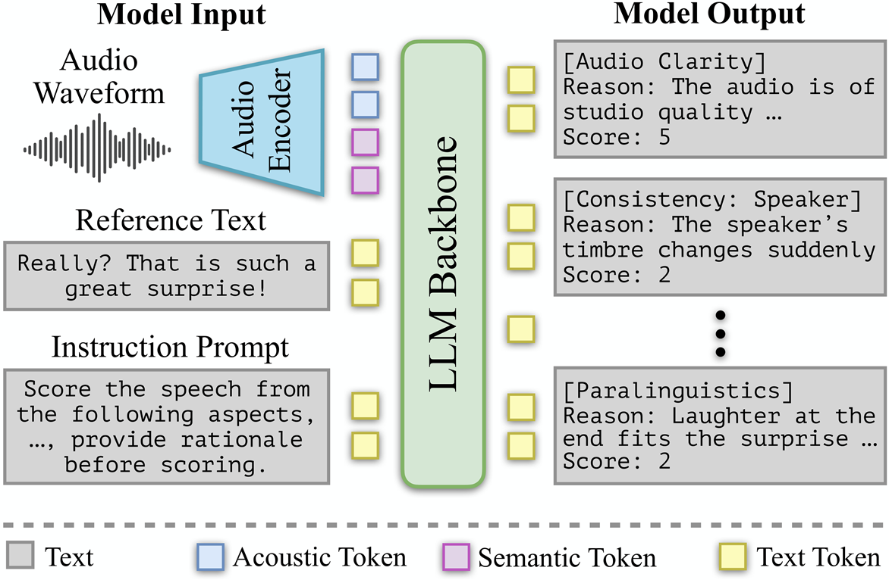

<h1 align="center">TTS-PRISM</h1>
<h3 align="center">A Perceptual Reasoning and Interpretable Speech Model for Fine-Grained Diagnosis</h3>

<p align="center">
  <a href="#-paper-link-placeholder"></a>
  <a href="https://huggingface.co/xiaomi-research/TTS-PRISM-7B"></a>
  <a href="https://github.com/xiaomi-research/tts-prism/blob/main/LICENSE"></a>
</p>
<p align="center">
  ⭐ If TTS-PRISM is helpful to your research, please help star this repo. Thanks! 🤗
</p>

---

## 📖 Introduction

While generative text-to-speech (TTS) models approach human-level quality, monolithic metrics fail to diagnose fine-grained acoustic artifacts or explain perceptual collapse. To address this, we propose **TTS-PRISM**, a multi-dimensional diagnostic framework for Mandarin. 

First, we establish a 12-dimensional schema spanning stability to advanced expressiveness. Second, we design a targeted synthesis pipeline with adversarial perturbations and expert anchors to build a high-quality diagnostic dataset. Third, schema-driven instruction tuning embeds explicit scoring criteria and reasoning into an efficient end-to-end model. Experiments on a 1,600-sample Gold Test Set show TTS-PRISM outperforms generalist models in human alignment. Profiling six TTS paradigms establishes intuitive diagnostic flags that reveal fine-grained capability differences.

For full details on the 12 evaluation dimensions, please refer to our [Scoring_Criteria.md](Scoring_Criteria.md).

## 🏗 Architecture Overview

<div align="center">
  
  <p><em>Figure 1: Overall architecture of the TTS-PRISM framework.</em></p>
</div>

## 📥 Model Download

The model weights are officially hosted on Hugging Face.

| Models | 🤗 Hugging Face |
| :--- | :--- |
| **MiMo-Audio-Tokenizer** | [XiaomiMiMo/MiMo-Audio-Tokenizer](https://huggingface.co/XiaomiMiMo/MiMo-Audio-Tokenizer) |
| **TTS-PRISM-7B** | [xiaomi-research/TTS-PRISM-7B](https://huggingface.co/xiaomi-research/TTS-PRISM-7B) |

We strongly recommend using the new `hf` CLI for fast, resumable downloads:

```bash
pip install -U "huggingface_hub[cli]"

# Download the Tokenizer
hf download XiaomiMiMo/MiMo-Audio-Tokenizer --local-dir ./checkpoints/MiMo-Audio-Tokenizer

# Download the TTS-PRISM-7B weights
hf download xiaomi-research/TTS-PRISM-7B --local-dir ./checkpoints/TTS-PRISM-7B
```

## 🚀 Getting Started

Spin up the inference diagnostic pipeline in minutes.

### Prerequisites (Linux)
* Python 3.12
* CUDA >= 12.0

### 1. Installation

Clone the repository and install the dependencies:

```bash
git clone https://github.com/xiaomi-research/tts-prism.git
cd tts-prism
pip install -r requirements.txt
pip install flash-attn==2.7.4.post1
```

> **Note on flash-attn:**
> If the compilation of `flash-attn` takes too long on your machine, you can download the precompiled wheel and install it manually:
> * [Download Precompiled Wheel](#-placeholder-for-wheel-link) *
> 
> ```bash
> pip install /path/to/flash_attn-2.7.4.post1+cu12torch2.6cxx11abiFALSE-cp312-cp312-linux_x86_64.whl
> ```

### 2. Running Inference

To diagnose an audio file using TTS-PRISM, run the single-pass inference script. *(Please ensure you have modified the paths in the script if your models are not downloaded to `./checkpoints/`)*.

```bash
python inference_diagnostic.py
```

## 📂 Core Structure

- `inference_diagnostic.py`: Single-pass inference script for 12-dimensional scoring and rationale generation.
- `Scoring_Criteria.md`: The comprehensive textual definitions and quantitative rubrics of our 12-dimensional evaluation schema.

## ✒️ Citation

If you find our work helpful, please cite our paper:

```bibtex
@article{wang2026ttsprism,
  title={TTS-PRISM: A Perceptual Reasoning and Interpretable Speech Model for Fine-Grained Diagnosis},
  author={Wang, Xi and Wang, Jie and Song, Xingchen and Song, Baijun and Shao, Jiahe and Wu, Di and Meng, Meng and Luan, Jian and Wu, Zhiyong},
  journal={arXiv preprint arXiv:待定编号},
  year={2026}
}
```

## ⚖️ License

This project is licensed under the Apache License 2.0 - see the [LICENSE](LICENSE) file for details.

Copyright (c) 2026 Xiaomi Corporation.
